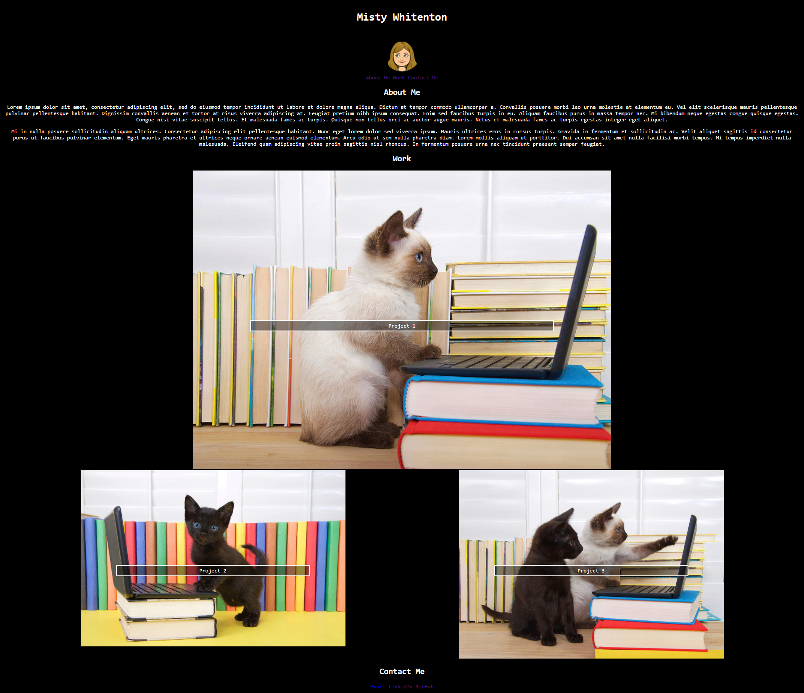

# Portfolio

## Description
- My motivation for this project was to create a professional portfolio so that potential employers can review samples of my work. 
- This was accomplished through using HTML elements to present my information, creating a navigation bar with links to each section of the portfolio, using CSS to style each element, and creating a responsive layout that adapts to the viewport using media queries. 

## Technology Used
- HTML
- CSS

## Screenshot

## Link
https://mistwhit.github.io/portfolio

## Resources 
"About Me" text generated by https://loremipsum.io/
